# 🎮 Flappy Bird 2D – Unity

Game Flappy Bird 2D được xây dựng bằng Unity, mô phỏng lại gameplay kinh điển:
chim bay qua các cột pipe, tránh va chạm và ghi điểm.

---

## 🛠 Công nghệ sử dụng

- **Unity Engine** (2D)
- **C#** (lập trình gameplay)
- **Git & GitHub** (quản lý mã nguồn)
- **Visual Studio Code**
- **ChatGPT** – hỗ trợ phân tích logic, debug và định hướng kiến trúc code (bạn đồng hành 🤝)

---

## 📌 Quy trình thực hiện

### Bước 1: Tạo project Unity

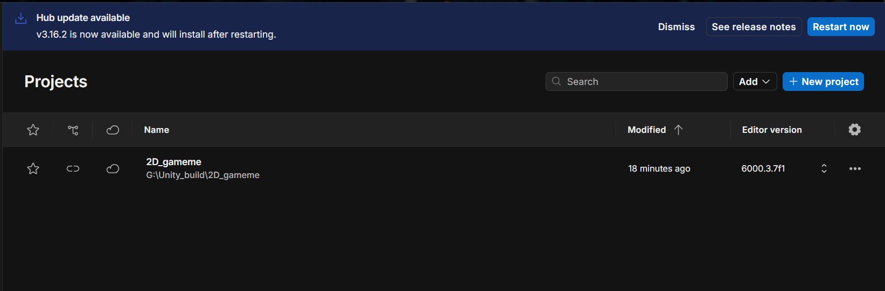

Tạo project Unity 2D mới, thiết lập cấu hình ban đầu cho game Flappy Bird.

---

### Bước 2: Chuẩn bị assets

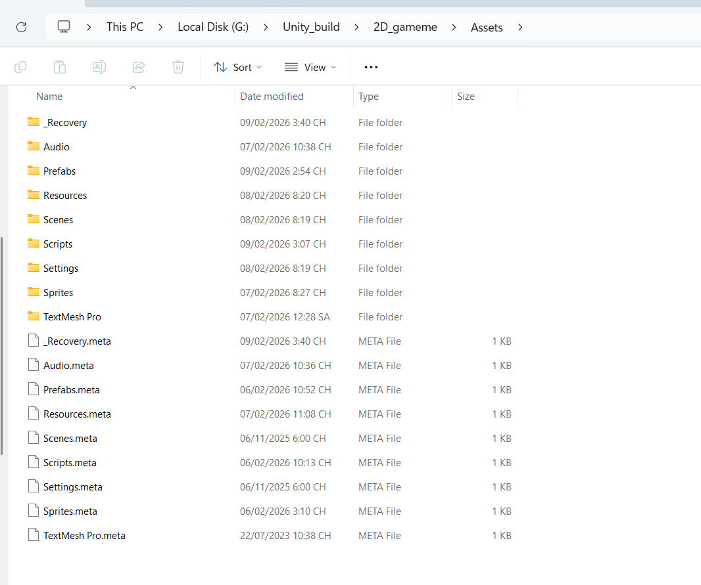  
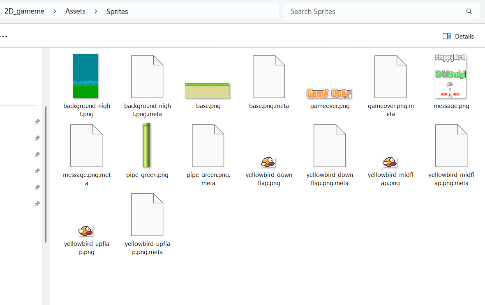  
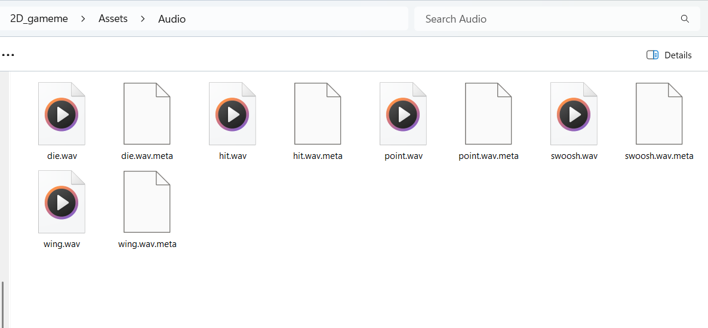

Chuẩn bị và import các assets cần thiết như:

- Sprite chim, nền, mặt đất
- Sprite cột pipe
- Âm thanh (bay, va chạm, ghi điểm)

---

### Bước 3: Tạo Scene gameplay

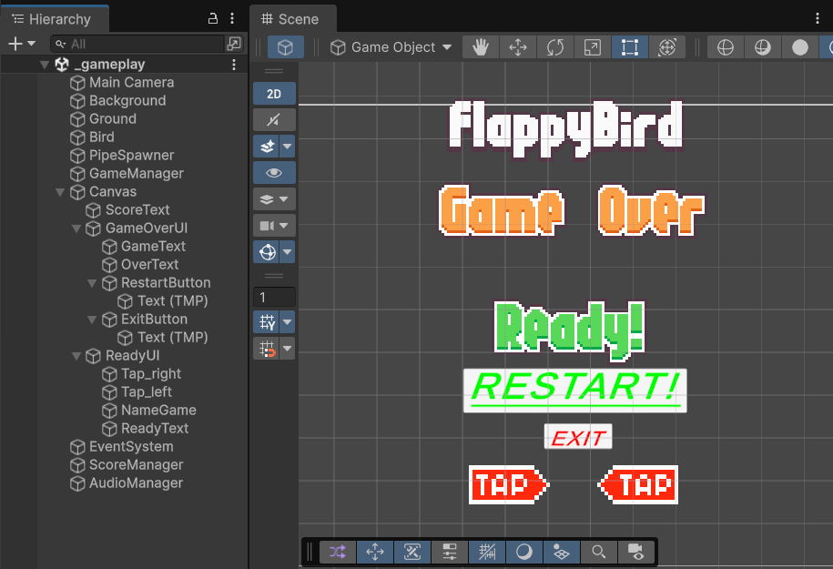

Xây dựng scene gameplay, sắp xếp các GameObject trong Hierarchy:

- Background
- Ground
- Bird
- PipeSpawner

---

### Bước 4: Lập trình điều khiển chim

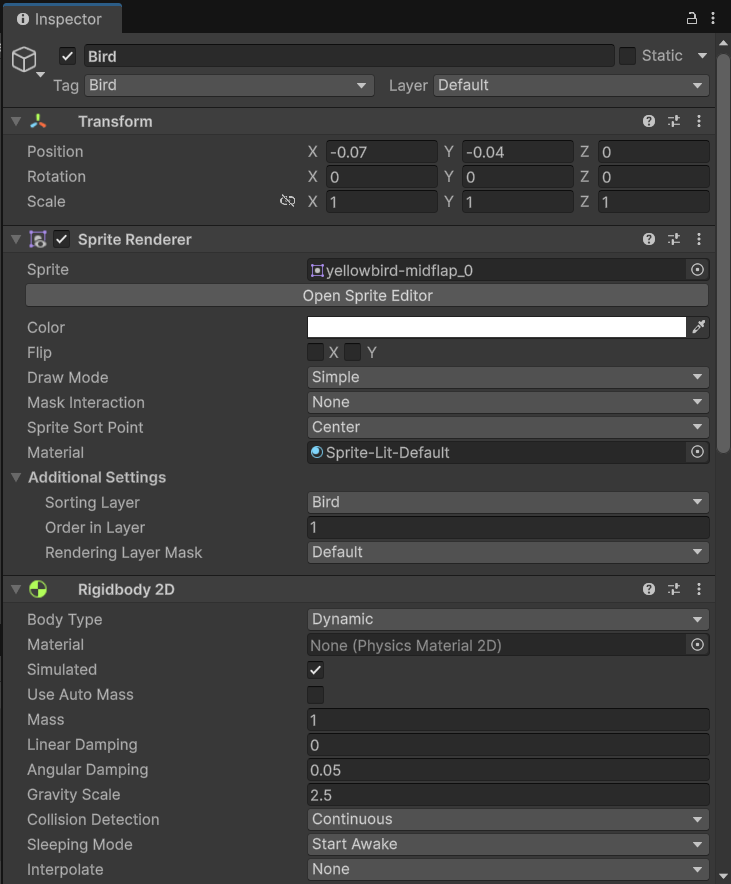  
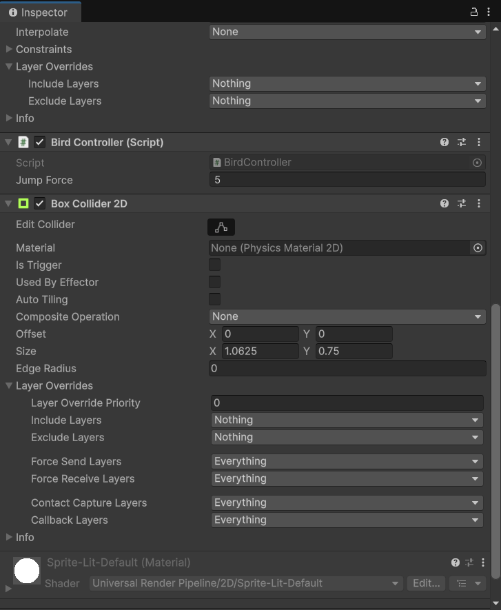  
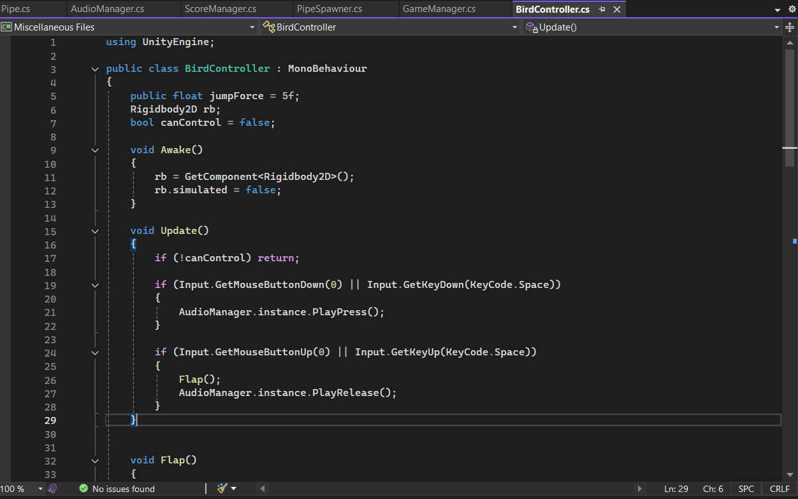

Lập trình cho chim:

- Bay lên khi nhấn phím
- Áp dụng trọng lực
- Xử lý va chạm với pipe và mặt đất

---

### Bước 5: Tạo Pipe và cơ chế sinh Pipe

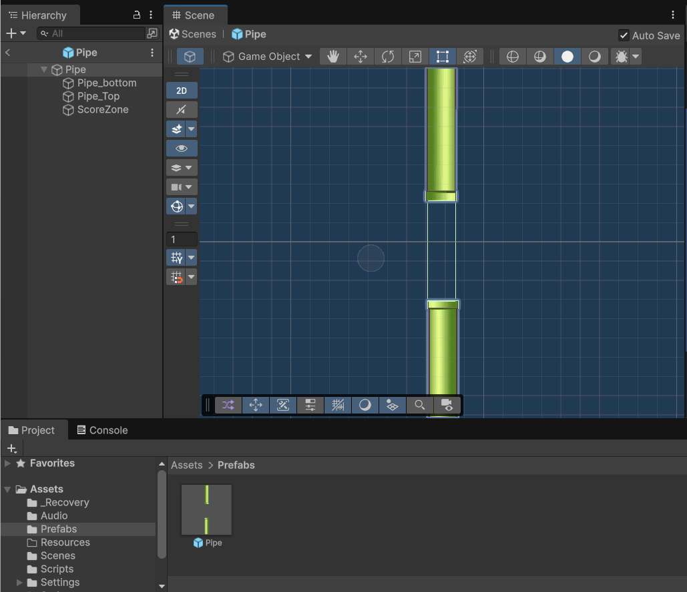  
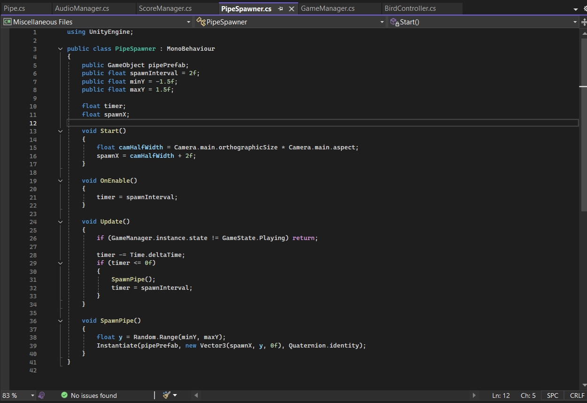

Tạo prefab pipe và viết script sinh pipe theo thời gian,  
di chuyển pipe từ phải sang trái và tự hủy khi ra khỏi màn hình.

---

### Bước 6: Xử lý Game Over & Restart

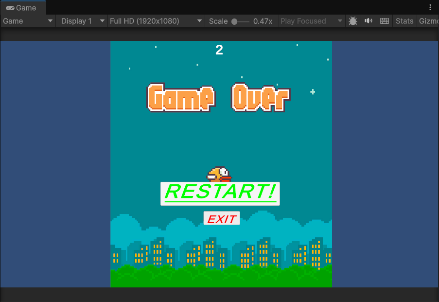  
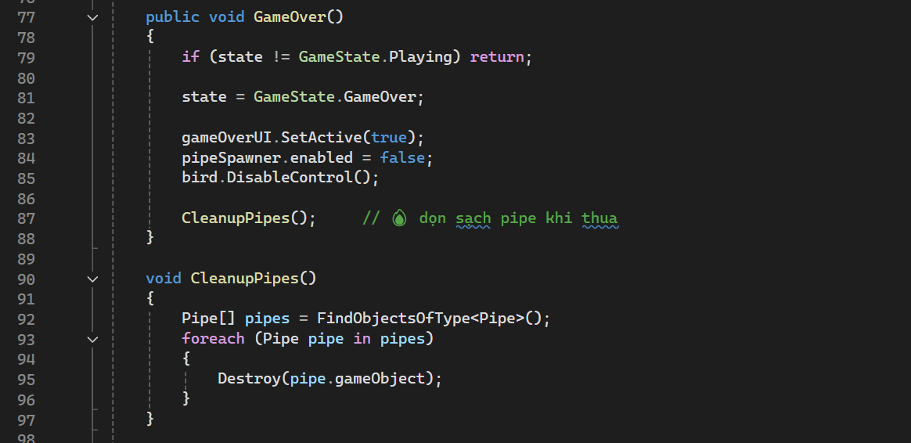

Xử lý khi chim va chạm:

- Hiển thị UI Game Over
- Dừng sinh pipe
- Cho phép restart game

---

### Bước 7: Hoàn thiện & chạy thử

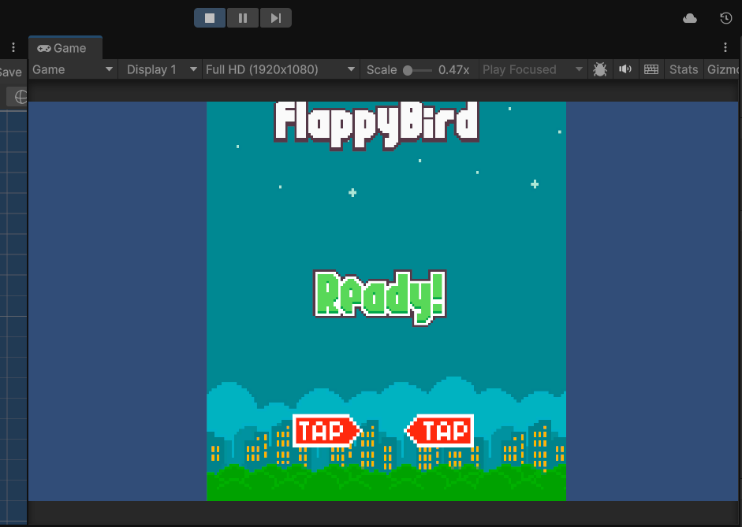

Chạy thử game, kiểm tra:

- Click **READY** → chuyển sang **Playing**
- Điều khiển chim
- Va chạm
- Tính điểm

---

### Bước 8: Đưa dự án lên GitHub

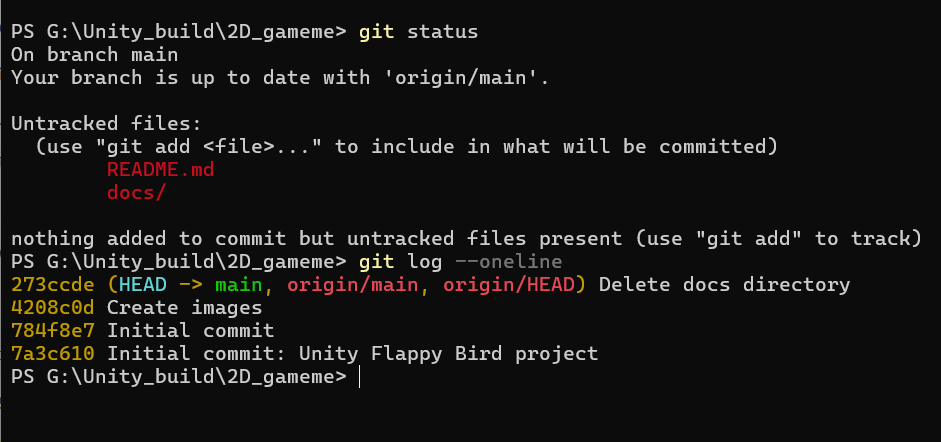  
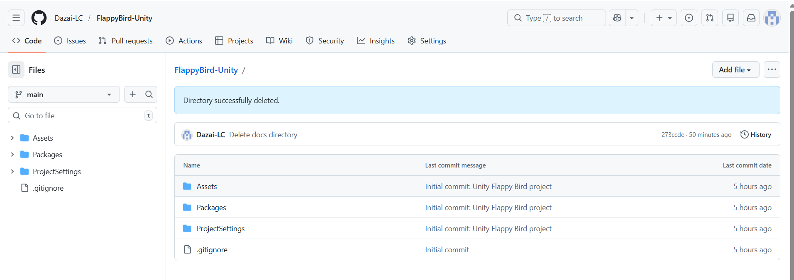

Khởi tạo Git repository, commit source code và đẩy project lên GitHub để quản lý và nộp bài.

---

## 👤 Tác giả

- **Sinh viên thực hiện:** Dazai / Lý Cương Legend
- **Hỗ trợ kỹ thuật & tư duy:** ChatGPT 🤖

---

## 📎 Link GitHub

🔗 https://github.com/Dazai-LC/FlappyBird-Unity
